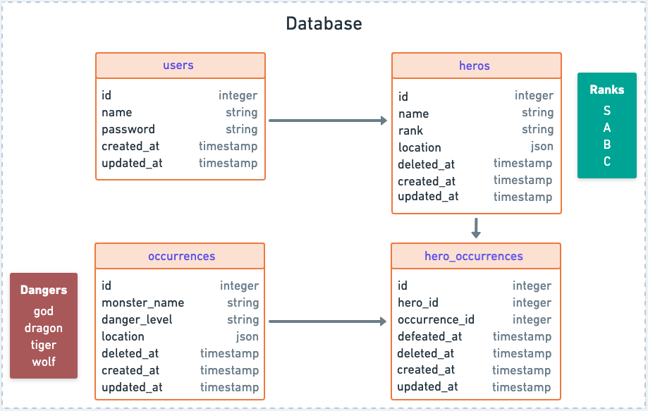
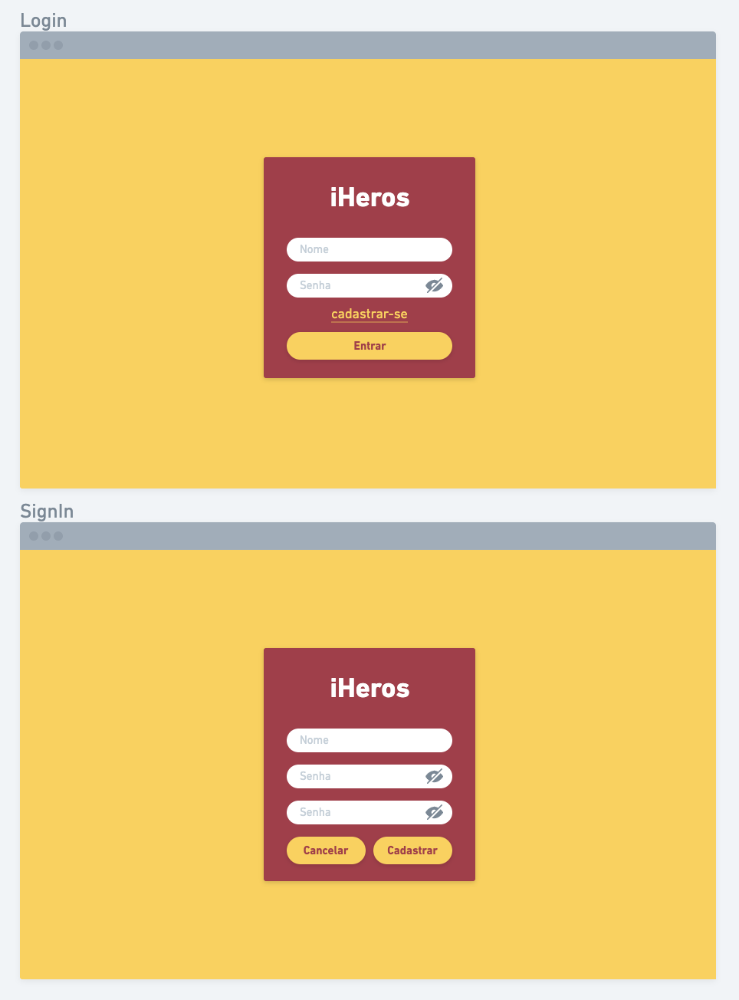
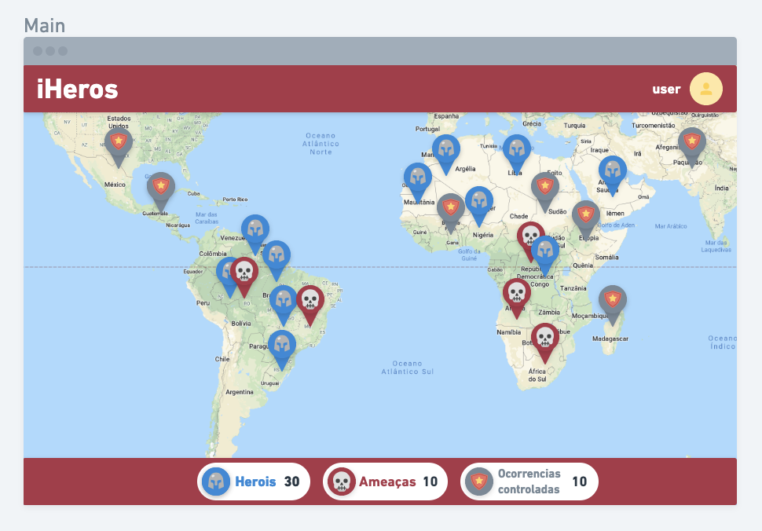
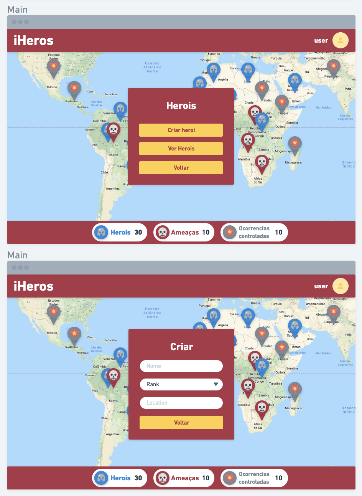
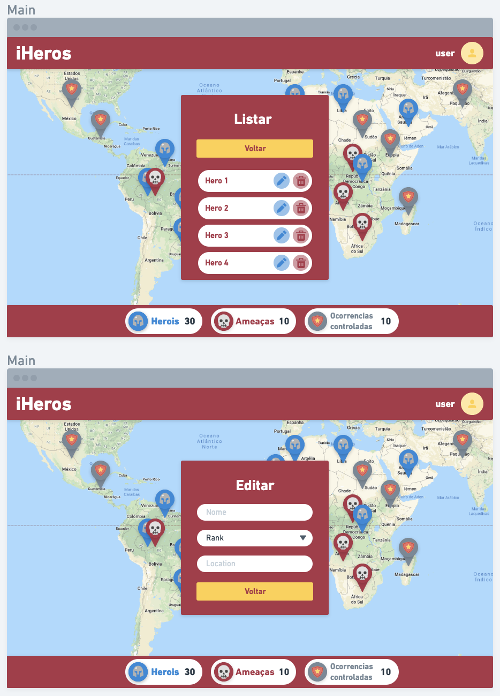

# iHeros

### This project is about how I solved the next problem:

You are in the year 3150 and you are in charge of the technology sector responsible for the development of the Heroes distribution management system to combat threats. The system should monitor the threat alert system provided by the UN and allocate heroes for each new threat on the globe.

# Roadmap

## Database

Although of being a simple schema, I've decided to model and create a database for the system, so we have these tables:

- users: Credentials for access the platform;
- heros: Hero's register, only a user can create/update/delete a hero;
- occurrences: Occurrence's register, an occurrence only is created when a socket message arrives with a new Thread;
- hero_occurrences: Relation for heros and occurrences;



## Backend

The idea on the backend was to keep it simple, there is 4 controllers one for each table, basically to handle the CRUD. I used JWT token for authentication and make that some routes are only accessible when the user is authenticated, there is some services to handle the logic for example, to assign a hero for a determined occurrence.

I've decided to use docker on api because it's more simple to run the project in another machine or even send it to production.

## Frontend

The idea was to make a dashboard where the user could visualize heroes, threats and the Occurrences that have been already defeated

This is a design example for the frontend:










## How to run the project

First of all make sure you have this installed:

```xml
Node v10 or later
postgres
docker and docker-compose
```

Clone this repo

```xml
https://github.com/Thierry-Santos/challenges.git
```

### Commands to run API (Backend)

go to: 

```xml
cd challenges/dev/api
```

... create a new file called .env and copy the content of .env.example inside your new file .env save and run this commands

```jsx
yarn install
docker-compose build
docker-compose up
docker-compose run --rm iheros yarn sequelize db:create
docker-compose run --rm iheros yarn sequelize db:migrate
```

To test the api without frontend there is a file called Insomnia.json, inside challenges/dev/api, just import this file in the insomnia software and all the workspace is configured, just when a authentication request is send it returns a token, you have to copy this token and place on workspace environment

### Commands to run WEB (Frontend)

go to: 

```xml
cd challenges/dev/web
```

... and run this commands

```jsx
yarn install
yarn start
```

## Technologies and libraries

This is the list of technologies and libraries used on this project

### Database

The database was created using postgres

### Backend

The API was build with node JS and using this dependencies:

```jsx
"bcryptjs"
"date-fns"
"express"
"jsonwebtoken"
"pg"
"pg-hstore"
"sequelize"
```

### Frontend

The WEB was build with React JS and using this 

```jsx
"react-router-dom"
"styled-components"
"react-icons"
"axios"
"cors"
"react-uuid"
"socket.io-client"
```

# Contact

Any problem feel free to contact me: thierrybarbosasantos@gmail.com